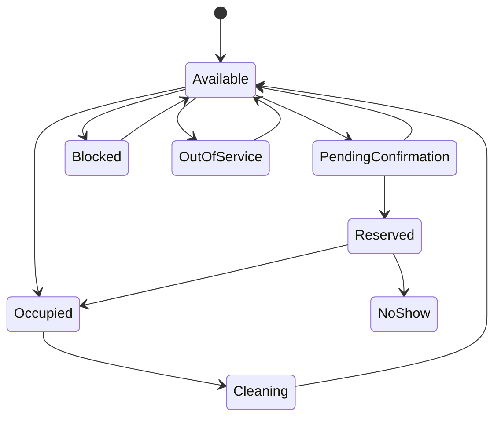
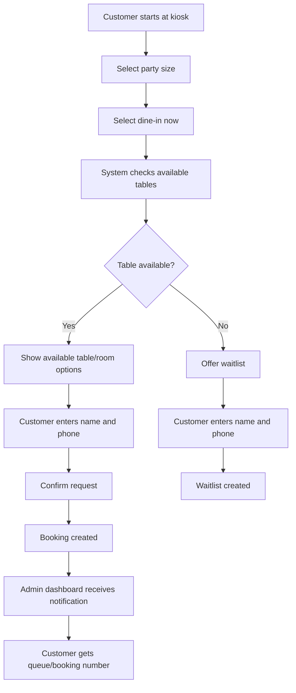
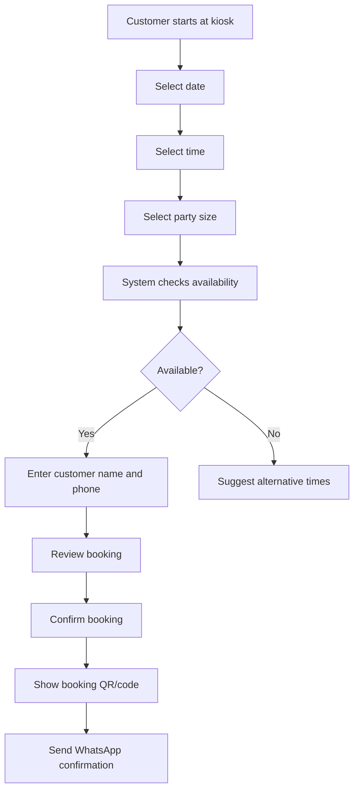
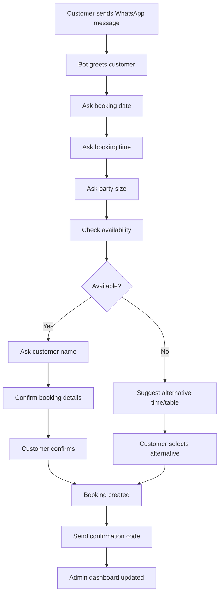
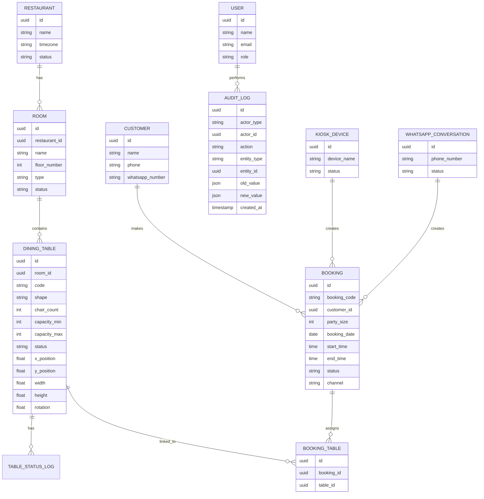

# PRD — Restaurant Table Management, Floor Plan, Booking, and Audit Trail System

**Product Name:** Restaurant Table Management System
**Version:** 1.0
**Document Type:** Product Requirements Document
**Target Users:** Restaurant owner, admin, host/front desk staff, waiters, cleaners, customers
**Primary Platforms:** Web Admin Dashboard, Kiosk App, WhatsApp Booking Flow
**Status:** Draft PRD
**Prepared For:** Restaurant digitalization project

---

## 1. Product Overview

The Restaurant Table Management System is a digital platform that helps restaurant owners manage physical restaurant layouts, dining tables, rooms, floor plans, bookings, real-time table status, and audit trails.

The system allows admins and restaurant staff to view the restaurant layout either as a **list view** or as a **visual draggable floor plan**. Tables can be created with different shapes, sizes, capacities, chair counts, and positions inside rooms or floors.

Customers can make bookings through two main channels:

1. **On-location Kiosk Hardware**
   A self-service kiosk placed inside the restaurant where customers can book or request a table.

2. **WhatsApp Booking**
   Customers can book a table through WhatsApp, either via bot automation, staff-assisted booking, or WhatsApp Business API integration.

Admins and staff can track table status in real time, such as:

* Available
* Reserved
* Occupied
* Cleaning
* Blocked
* Out of service
* Pending confirmation
* No-show
* Completed

The system also includes a full **audit trail**, so every important action is logged, including who changed table status, who created or updated a booking, when a table was moved in the floor plan, and what values changed.

---

## 2. Problem Statement

Many restaurants still manage tables, reservations, walk-ins, and floor plans manually using paper, spreadsheets, chat messages, or verbal communication. This creates several problems:

* Double bookings can happen.
* Staff may not know which tables are available, occupied, or cleaning.
* Managers cannot easily monitor table turnover.
* WhatsApp bookings may be missed or forgotten.
* Kiosk or walk-in booking is not connected to the admin dashboard.
* No reliable audit trail exists for operational actions.
* Restaurant layout changes are difficult to visualize.
* Room and table management becomes messy when the restaurant has many rooms or floors.

This product solves those problems by creating a centralized digital system for table layout, booking, real-time status tracking, and operational accountability.

---

## 3. Product Goals

### 3.1 Business Goals

* Reduce manual table management.
* Prevent double booking.
* Increase reservation accuracy.
* Improve table turnover visibility.
* Help staff coordinate better during busy hours.
* Create a reliable audit trail for management review.
* Support scalable restaurant layouts with multiple rooms, floors, and table types.
* Provide a better booking experience through kiosk and WhatsApp.

### 3.2 User Goals

Restaurant owners and admins should be able to:

* Digitally create restaurant rooms, floors, and table layouts.
* See all tables in list view or visual floor plan view.
* Drag and drop tables on a digital floor plan.
* Manage table status in real time.
* See incoming bookings from kiosk and WhatsApp.
* Track who did what, when, and why.
* Create, update, delete, or disable rooms and tables.
* View booking history and table history.

Customers should be able to:

* Book a table from kiosk or WhatsApp.
* See available time slots or table options when allowed.
* Receive booking confirmation.
* Cancel or modify a booking, depending on restaurant policy.
* Check booking status.

---

## 4. Success Metrics

| Metric                           |                                Target |
| -------------------------------- | ------------------------------------: |
| Double booking incidents         |                         Reduce by 90% |
| Average table assignment time    |                      Under 30 seconds |
| Table status update delay        |                       Under 5 seconds |
| Booking confirmation time        | Under 1 minute for automated channels |
| Staff adoption rate              |               80%+ active daily usage |
| Audit trail completeness         |                  100% for key actions |
| Kiosk booking completion rate    |                                  70%+ |
| WhatsApp booking completion rate |                                  60%+ |
| No-show tracking accuracy        |                                  95%+ |

---

## 5. Target Users and Personas

### 5.1 Restaurant Owner

The owner wants to monitor all rooms, tables, bookings, and activity history. They care about operational control, revenue, efficiency, and accountability.

**Needs:**

* View dashboard summary.
* Monitor table occupancy.
* Track bookings by channel.
* Review audit logs.
* Analyze table usage.
* Manage restaurant layout.

---

### 5.2 Admin / Manager

The admin manages daily operations, table setup, bookings, rooms, and staff permissions.

**Needs:**

* CRUD rooms and tables.
* Configure table capacity, shape, chair count, and status.
* Update floor plan.
* Handle booking issues.
* Override table status.
* Export reports.

---

### 5.3 Host / Front Desk Staff

The host manages walk-ins, table assignment, and reservation check-ins.

**Needs:**

* See available and reserved tables quickly.
* Assign customers to tables.
* Mark guests as arrived.
* Change status from reserved to occupied.
* Handle waiting list.
* Search bookings by name or phone number.

---

### 5.4 Waiter / Floor Staff

Waiters need to know which tables are occupied, cleaning, or ready.

**Needs:**

* View table status.
* Mark table as occupied.
* Request cleaning.
* See table notes.
* Know customer booking details when needed.

---

### 5.5 Cleaner / Busser

Cleaning staff only needs simple access to cleaning-related table status.

**Needs:**

* See tables marked as cleaning.
* Mark cleaning as completed.
* Notify front desk that table is available.

---

### 5.6 Customer

Customers use WhatsApp or kiosk to book or request a table.

**Needs:**

* Easy booking flow.
* Clear confirmation.
* Ability to cancel or reschedule.
* Estimated wait time for walk-ins.
* Booking reminder.

---

## 6. Product Scope

## 6.1 In Scope — MVP

The MVP should include:

* Admin login.
* Role-based access.
* Restaurant room CRUD.
* Table/desk CRUD.
* Table shape selection: round, square, rectangle, custom.
* Chair number / capacity configuration.
* Table status management.
* List view of rooms and tables.
* Floor plan view.
* Drag-and-drop table positioning.
* Booking management.
* Kiosk booking channel.
* WhatsApp booking channel.
* Manual admin booking override.
* Real-time status updates.
* Audit trail for key actions.
* Search and filters.
* Basic reporting dashboard.

---

## 6.2 Out of Scope — MVP

The following should not be required in the first MVP unless the business wants a more advanced first release:

* Full POS integration.
* Online payment or deposit.
* Customer loyalty program.
* AI table optimization.
* Kitchen order management.
* Food ordering from table.
* Multi-branch advanced reporting.
* 3D floor plan.
* IoT sensor integration.
* Facial recognition.
* Advanced CRM segmentation.

These can be added in later phases.

---

# 7. Core Modules

## 7.1 Admin Dashboard

The admin dashboard is the main control center for restaurant staff.

### Key Features

* Real-time table status overview.
* Room and floor management.
* Floor plan editor.
* Booking calendar.
* Booking list.
* Kiosk booking monitoring.
* WhatsApp booking monitoring.
* Audit trail.
* User and role management.
* Reports and analytics.

### Dashboard Summary Cards

The dashboard should show:

* Total tables.
* Available tables.
* Occupied tables.
* Reserved tables.
* Cleaning tables.
* Blocked tables.
* Today’s bookings.
* Upcoming bookings.
* Walk-in/kiosk requests.
* WhatsApp booking requests.
* No-shows.
* Average table turnover time.

---

## 7.2 Room and Floor Management

Admins can create and manage rooms, floors, and sections inside the restaurant.

### Examples

* Ground Floor
* Second Floor
* VIP Room
* Smoking Area
* Outdoor Area
* Private Dining Room
* Bar Area
* Event Hall

### Functional Requirements

| ID     | Requirement                                                        | Priority    |
| ------ | ------------------------------------------------------------------ | ----------- |
| RM-001 | Admin can create a room or floor                                   | Must Have   |
| RM-002 | Admin can update room name, description, and status                | Must Have   |
| RM-003 | Admin can delete a room if no active tables or bookings are linked | Must Have   |
| RM-004 | Admin can deactivate a room without deleting historical data       | Must Have   |
| RM-005 | Admin can upload or configure room background/floor plan image     | Should Have |
| RM-006 | Admin can define room dimensions for floor plan editor             | Should Have |
| RM-007 | Admin can sort room display order                                  | Should Have |
| RM-008 | Admin can filter tables by room                                    | Must Have   |

### Room Fields

| Field                  | Type      | Description                               |
| ---------------------- | --------- | ----------------------------------------- |
| `id`                   | UUID      | Unique room ID                            |
| `restaurant_id`        | UUID      | Parent restaurant                         |
| `name`                 | String    | Room name                                 |
| `description`          | Text      | Optional room description                 |
| `floor_number`         | Integer   | Floor level                               |
| `type`                 | Enum      | Indoor, outdoor, VIP, bar, private, other |
| `status`               | Enum      | Active, inactive, maintenance             |
| `layout_width`         | Number    | Floor plan canvas width                   |
| `layout_height`        | Number    | Floor plan canvas height                  |
| `background_image_url` | String    | Optional floor plan background            |
| `created_at`           | Timestamp | Creation time                             |
| `updated_at`           | Timestamp | Last update time                          |

---

## 7.3 Table / Desk Management

The system should let admins create digital representations of physical dining tables.

### Supported Table Shapes

* Round
* Square
* Rectangle
* Oval
* Custom
* Booth
* Bar seat
* Long communal table

### Functional Requirements

| ID     | Requirement                                        | Priority    |
| ------ | -------------------------------------------------- | ----------- |
| TB-001 | Admin can create a table/desk                      | Must Have   |
| TB-002 | Admin can update table name/code                   | Must Have   |
| TB-003 | Admin can assign table to a room                   | Must Have   |
| TB-004 | Admin can define table capacity/chair count        | Must Have   |
| TB-005 | Admin can choose table shape                       | Must Have   |
| TB-006 | Admin can set table width and height               | Should Have |
| TB-007 | Admin can rotate table in floor plan               | Should Have |
| TB-008 | Admin can drag and drop table position             | Must Have   |
| TB-009 | Admin can duplicate a table                        | Should Have |
| TB-010 | Admin can delete table if no active booking exists | Must Have   |
| TB-011 | Admin can deactivate table for maintenance         | Must Have   |
| TB-012 | Admin can merge tables temporarily                 | Should Have |
| TB-013 | Admin can split merged tables                      | Should Have |
| TB-014 | Admin can add notes to a table                     | Should Have |
| TB-015 | Admin can see table history                        | Must Have   |

### Table Fields

| Field           | Type      | Description                                                      |
| --------------- | --------- | ---------------------------------------------------------------- |
| `id`            | UUID      | Unique table ID                                                  |
| `restaurant_id` | UUID      | Restaurant ID                                                    |
| `room_id`       | UUID      | Assigned room                                                    |
| `code`          | String    | Example: A01, VIP-02                                             |
| `name`          | String    | Display name                                                     |
| `shape`         | Enum      | Round, square, rectangle, oval, booth, custom                    |
| `capacity_min`  | Integer   | Minimum comfortable capacity                                     |
| `capacity_max`  | Integer   | Maximum capacity                                                 |
| `chair_count`   | Integer   | Number of chairs                                                 |
| `status`        | Enum      | Available, reserved, occupied, cleaning, blocked, out_of_service |
| `x_position`    | Number    | X coordinate in floor plan                                       |
| `y_position`    | Number    | Y coordinate in floor plan                                       |
| `width`         | Number    | Visual width                                                     |
| `height`        | Number    | Visual height                                                    |
| `rotation`      | Number    | Rotation degree                                                  |
| `is_active`     | Boolean   | Active or inactive                                               |
| `notes`         | Text      | Internal table notes                                             |
| `created_at`    | Timestamp | Created time                                                     |
| `updated_at`    | Timestamp | Last update time                                                 |

---

## 7.4 Floor Plan View

The floor plan view allows admins and staff to see a visual map of the restaurant.

### Main Features

* View all rooms or one room at a time.
* Drag and drop tables.
* Resize tables.
* Rotate tables.
* Change table shape.
* Show real-time table status by color.
* Click table to see details.
* Assign booking to a table.
* Lock layout editing for non-admin users.
* Zoom in/out.
* Pan canvas.
* Optional background image upload.
* Save layout version.

### Table Status Color Suggestions

| Status               | Suggested Color Meaning |
| -------------------- | ----------------------- |
| Available            | Green                   |
| Reserved             | Blue                    |
| Occupied             | Red                     |
| Cleaning             | Yellow / Orange         |
| Blocked              | Gray                    |
| Out of Service       | Dark Gray               |
| Pending Confirmation | Purple                  |
| No-show              | Brown                   |

The actual color palette should be configurable or adjusted by UI/UX design.

### Floor Plan Requirements

| ID     | Requirement                                          | Priority    |
| ------ | ---------------------------------------------------- | ----------- |
| FP-001 | User can view tables visually by room                | Must Have   |
| FP-002 | Admin can drag and drop table position               | Must Have   |
| FP-003 | Admin can resize table object                        | Should Have |
| FP-004 | Admin can rotate table object                        | Should Have |
| FP-005 | Admin can save floor plan layout                     | Must Have   |
| FP-006 | Admin can undo unsaved changes                       | Should Have |
| FP-007 | Staff can click table to update status               | Must Have   |
| FP-008 | Staff can click table to assign booking              | Must Have   |
| FP-009 | System prevents unauthorized layout editing          | Must Have   |
| FP-010 | Table status updates in real time                    | Must Have   |
| FP-011 | System supports list view and floor plan view toggle | Must Have   |

---

## 7.5 List View

Some users prefer a fast operational list instead of a visual floor plan.

### List Columns

| Column          | Description                               |
| --------------- | ----------------------------------------- |
| Table Code      | Example: A01                              |
| Room            | Example: VIP Room                         |
| Shape           | Round, square, rectangle                  |
| Chair Count     | Number of chairs                          |
| Capacity        | Min/max guest capacity                    |
| Current Status  | Available, reserved, occupied, etc.       |
| Current Booking | Linked booking if any                     |
| Next Booking    | Next upcoming reservation                 |
| Last Updated By | Staff name                                |
| Last Updated At | Timestamp                                 |
| Actions         | View, edit, change status, assign booking |

### Filters

* Room
* Status
* Capacity
* Shape
* Booking channel
* Current booking
* Next booking time
* Active/inactive

---

# 8. Table Status Management

## 8.1 Table Status Definitions

| Status               | Meaning                                                            |
| -------------------- | ------------------------------------------------------------------ |
| Available            | Table is clean and ready for guests                                |
| Reserved             | Table is assigned to a confirmed future booking                    |
| Occupied             | Guests are currently seated                                        |
| Cleaning             | Guests left and table is being cleaned                             |
| Blocked              | Table is temporarily unavailable                                   |
| Out of Service       | Table cannot be used due to damage, maintenance, event setup, etc. |
| Pending Confirmation | Table is temporarily held while booking is not yet confirmed       |
| No-show              | Booking guest did not arrive within grace period                   |
| Completed            | Booking/visit has ended                                            |

---

## 8.2 Status Lifecycle



---

## 8.3 Status Transition Rules

| From                 | To                   | Trigger                   | Allowed Roles         |
| -------------------- | -------------------- | ------------------------- | --------------------- |
| Available            | Pending Confirmation | Customer starts booking   | System, Admin         |
| Pending Confirmation | Reserved             | Booking confirmed         | System, Admin, Host   |
| Pending Confirmation | Available            | Booking expired/cancelled | System, Admin         |
| Available            | Occupied             | Walk-in seated            | Admin, Host, Waiter   |
| Reserved             | Occupied             | Guest checks in           | Admin, Host           |
| Reserved             | No-show              | Grace period expired      | System, Admin, Host   |
| Occupied             | Cleaning             | Guest leaves              | Host, Waiter, Cleaner |
| Cleaning             | Available            | Cleaning completed        | Cleaner, Host, Admin  |
| Available            | Blocked              | Admin blocks table        | Admin, Manager        |
| Blocked              | Available            | Admin unblocks table      | Admin, Manager        |
| Available            | Out of Service       | Maintenance issue         | Admin, Manager        |
| Out of Service       | Available            | Maintenance completed     | Admin, Manager        |

---

## 8.4 Status Change Requirements

| ID     | Requirement                                              | Priority    |
| ------ | -------------------------------------------------------- | ----------- |
| ST-001 | Staff can change table status based on permission        | Must Have   |
| ST-002 | Every status change creates audit log                    | Must Have   |
| ST-003 | System records old status and new status                 | Must Have   |
| ST-004 | System records actor, timestamp, channel, and reason     | Must Have   |
| ST-005 | System prevents invalid status transitions               | Must Have   |
| ST-006 | System can auto-change status after booking cancellation | Should Have |
| ST-007 | System can auto-mark no-show after grace period          | Should Have |
| ST-008 | Admin can override status with reason                    | Must Have   |

---

# 9. Booking Management

## 9.1 Booking Channels

The system supports two customer-facing booking methods:

1. **Kiosk Booking**
2. **WhatsApp Booking**

The admin dashboard may also allow internal staff to create bookings manually, but the main customer booking channels are kiosk and WhatsApp.

---

## 9.2 Booking Types

| Booking Type       | Description                                                 |
| ------------------ | ----------------------------------------------------------- |
| Immediate Walk-in  | Customer is already at the restaurant and wants a table now |
| Future Reservation | Customer books for a future date and time                   |
| Waitlist           | Customer joins queue when no table is available             |
| VIP Booking        | Special booking requiring staff review                      |
| Group Booking      | Large party requiring multiple tables or room               |

---

## 9.3 Booking Statuses

| Status               | Meaning                                    |
| -------------------- | ------------------------------------------ |
| Draft                | Booking started but not completed          |
| Pending Confirmation | Waiting for customer or staff confirmation |
| Confirmed            | Booking is confirmed                       |
| Checked In           | Customer arrived                           |
| Seated               | Customer is assigned and seated            |
| Completed            | Visit is finished                          |
| Cancelled            | Booking cancelled                          |
| Expired              | Booking hold expired                       |
| No-show              | Customer did not arrive                    |
| Rescheduled          | Booking moved to another time              |

---

## 9.4 Booking Fields

| Field                      | Type      | Description                      |
| -------------------------- | --------- | -------------------------------- |
| `id`                       | UUID      | Booking ID                       |
| `booking_code`             | String    | Human-readable code              |
| `restaurant_id`            | UUID      | Restaurant ID                    |
| `customer_id`              | UUID      | Customer profile                 |
| `customer_name`            | String    | Customer name                    |
| `customer_phone`           | String    | Customer WhatsApp/phone          |
| `party_size`               | Integer   | Number of guests                 |
| `booking_date`             | Date      | Booking date                     |
| `start_time`               | Time      | Booking start time               |
| `end_time`                 | Time      | Estimated end time               |
| `duration_minutes`         | Integer   | Estimated dining duration        |
| `status`                   | Enum      | Pending, confirmed, seated, etc. |
| `channel`                  | Enum      | Kiosk, WhatsApp, Admin           |
| `assigned_table_ids`       | Array     | One or more table IDs            |
| `room_preference`          | String    | Optional room preference         |
| `special_request`          | Text      | Customer notes                   |
| `internal_notes`           | Text      | Staff-only notes                 |
| `source_device_id`         | UUID      | Kiosk device ID if applicable    |
| `whatsapp_conversation_id` | UUID      | WhatsApp conversation link       |
| `created_by`               | UUID      | Staff/system actor               |
| `created_at`               | Timestamp | Created time                     |
| `updated_at`               | Timestamp | Last update time                 |
| `cancelled_at`             | Timestamp | Cancellation time                |
| `cancel_reason`            | Text      | Cancellation reason              |

---

## 9.5 Booking Rules

### Availability Rules

* A table cannot have overlapping confirmed bookings.
* A booking can be assigned to one or multiple tables.
* Table capacity should match party size.
* Admin can override capacity rules with reason.
* Booking duration should be configurable.
* Booking buffer time should be configurable.
* Grace period should be configurable.
* No-show policy should be configurable.
* Cleaning time after occupancy should be configurable.

### Example Configuration

| Setting                      | Example Value |
| ---------------------------- | ------------: |
| Default booking duration     |    90 minutes |
| Booking buffer time          |    15 minutes |
| Grace period                 |    15 minutes |
| Cleaning duration            |    10 minutes |
| Max future booking window    |       30 days |
| Minimum booking lead time    |    30 minutes |
| Auto-release pending booking |     5 minutes |

---

## 9.6 Booking Conflict Prevention

The system must prevent:

* Same table booked by two customers at the same time.
* Table marked out of service being booked.
* Table under cleaning being assigned to immediate walk-in.
* Deleted or inactive table being assigned.
* Booking assigned to room that is inactive.
* Capacity mismatch without admin override.
* Multiple staff assigning the same table at the same time.

### Concurrency Requirement

When two users try to assign the same table at the same time, the system must lock or validate the assignment before confirmation.

---

# 10. Kiosk Booking Module

## 10.1 Overview

The kiosk is a self-service booking device placed inside the restaurant. It allows customers to request a table, join the waitlist, or make a reservation without staff assistance.

The kiosk should run in full-screen mode on dedicated hardware such as a tablet, touchscreen terminal, or self-service ordering machine.

---

## 10.2 Kiosk User Flow — Immediate Table Request



---

## 10.3 Kiosk User Flow — Future Reservation



---

## 10.4 Kiosk Requirements

| ID     | Requirement                                                | Priority    |
| ------ | ---------------------------------------------------------- | ----------- |
| KS-001 | Customer can select party size                             | Must Have   |
| KS-002 | Customer can choose dine-in now or future reservation      | Must Have   |
| KS-003 | Customer can enter name and phone number                   | Must Have   |
| KS-004 | System validates phone number                              | Must Have   |
| KS-005 | Kiosk can show available time slots                        | Should Have |
| KS-006 | Kiosk can show available room/table options                | Should Have |
| KS-007 | Kiosk can generate booking code or QR                      | Must Have   |
| KS-008 | Kiosk can send booking confirmation through WhatsApp       | Should Have |
| KS-009 | Kiosk can create waitlist entry when no table is available | Should Have |
| KS-010 | Kiosk has admin/device settings screen                     | Must Have   |
| KS-011 | Kiosk device is linked to restaurant branch/location       | Must Have   |
| KS-012 | Kiosk actions are logged in audit trail                    | Must Have   |
| KS-013 | Kiosk supports locked full-screen mode                     | Should Have |
| KS-014 | Kiosk supports offline fallback message                    | Should Have |

---

## 10.5 Kiosk Admin Controls

Admins should be able to:

* Register kiosk device.
* Rename kiosk device.
* Assign kiosk to restaurant branch or room.
* Enable or disable booking types.
* Configure kiosk language.
* Configure idle screen.
* Set kiosk maintenance mode.
* View kiosk health status.
* View kiosk booking history.

---

# 11. WhatsApp Booking Module

## 11.1 Overview

Customers can book tables through WhatsApp. This can be implemented using WhatsApp Business API, a WhatsApp bot, or staff-assisted booking with dashboard support.

The ideal version uses WhatsApp Business API so the system can automatically handle booking conversations.

---

## 11.2 WhatsApp Booking Flow



---

## 11.3 WhatsApp Requirements

| ID     | Requirement                                             | Priority    |
| ------ | ------------------------------------------------------- | ----------- |
| WA-001 | Customer can start booking from WhatsApp                | Must Have   |
| WA-002 | Bot can collect date, time, party size, name, and phone | Must Have   |
| WA-003 | System can check table availability                     | Must Have   |
| WA-004 | System can suggest alternative times                    | Should Have |
| WA-005 | System can confirm booking through WhatsApp             | Must Have   |
| WA-006 | Customer can cancel booking through WhatsApp            | Should Have |
| WA-007 | Customer can reschedule booking through WhatsApp        | Should Have |
| WA-008 | System sends booking reminder                           | Should Have |
| WA-009 | Admin can see WhatsApp booking source                   | Must Have   |
| WA-010 | Admin can take over WhatsApp conversation manually      | Should Have |
| WA-011 | WhatsApp messages are linked to booking record          | Should Have |
| WA-012 | WhatsApp booking actions are logged in audit trail      | Must Have   |
| WA-013 | System handles unsupported messages gracefully          | Should Have |

---

## 11.4 WhatsApp Message Templates

### Booking Confirmation

```text
Hi {{customer_name}}, your booking is confirmed.

Booking Code: {{booking_code}}
Date: {{booking_date}}
Time: {{booking_time}}
Guests: {{party_size}}
Table/Room: {{table_or_room}}

Please arrive within {{grace_period}} minutes of your booking time.
Reply CANCEL to cancel your booking.
```

### Booking Reminder

```text
Reminder: You have a booking today at {{booking_time}} for {{party_size}} guests.

Booking Code: {{booking_code}}
Reply CANCEL if you need to cancel.
```

### No Availability

```text
Sorry, there is no available table for {{party_size}} guests at {{booking_time}}.

Available alternatives:
1. {{alternative_time_1}}
2. {{alternative_time_2}}
3. {{alternative_time_3}}

Reply with the number to choose another time.
```

### Cancellation Confirmation

```text
Your booking {{booking_code}} has been cancelled.

Thank you for letting us know.
```

---

# 12. Audit Trail Module

## 12.1 Overview

The audit trail records all important system actions. This is critical for accountability, dispute resolution, and operational transparency.

Audit logs should be immutable. Normal users should not be able to edit or delete audit logs.

---

## 12.2 Actions to Log

The system must log:

* User login.
* User logout.
* Failed login attempt.
* Room created.
* Room updated.
* Room deleted.
* Room deactivated.
* Table created.
* Table updated.
* Table deleted.
* Table moved in floor plan.
* Table resized.
* Table status changed.
* Booking created.
* Booking updated.
* Booking cancelled.
* Booking confirmed.
* Booking checked in.
* Booking marked no-show.
* Booking assigned to table.
* Booking table assignment changed.
* Kiosk booking created.
* WhatsApp booking created.
* Admin override performed.
* User role changed.
* Permission changed.
* System setting changed.

---

## 12.3 Audit Log Fields

| Field           | Type      | Description                                     |
| --------------- | --------- | ----------------------------------------------- |
| `id`            | UUID      | Audit log ID                                    |
| `restaurant_id` | UUID      | Restaurant ID                                   |
| `actor_type`    | Enum      | Admin, staff, customer, system, kiosk, WhatsApp |
| `actor_id`      | UUID      | User, customer, or device ID                    |
| `actor_name`    | String    | Display name                                    |
| `action`        | String    | Example: TABLE_STATUS_CHANGED                   |
| `entity_type`   | String    | Table, room, booking, user                      |
| `entity_id`     | UUID      | Affected record                                 |
| `old_value`     | JSON      | Previous value                                  |
| `new_value`     | JSON      | New value                                       |
| `reason`        | Text      | Required for override actions                   |
| `channel`       | Enum      | Admin dashboard, kiosk, WhatsApp, system        |
| `ip_address`    | String    | IP address when available                       |
| `device_id`     | String    | Device ID when available                        |
| `created_at`    | Timestamp | Action timestamp                                |

---

## 12.4 Audit Trail Requirements

| ID     | Requirement                                                   | Priority    |
| ------ | ------------------------------------------------------------- | ----------- |
| AU-001 | System logs all critical actions                              | Must Have   |
| AU-002 | Audit logs include actor, action, timestamp, and entity       | Must Have   |
| AU-003 | Audit logs include old and new values for updates             | Must Have   |
| AU-004 | Audit logs cannot be edited by normal users                   | Must Have   |
| AU-005 | Admin can search audit logs                                   | Must Have   |
| AU-006 | Admin can filter audit logs by user, action, entity, and date | Must Have   |
| AU-007 | Admin can export audit logs                                   | Should Have |
| AU-008 | Override actions require reason                               | Must Have   |
| AU-009 | System logs kiosk and WhatsApp actions                        | Must Have   |
| AU-010 | Audit logs should be retained based on policy                 | Must Have   |

---

# 13. Role-Based Access Control

## 13.1 Roles

| Role         | Description                                         |
| ------------ | --------------------------------------------------- |
| Owner        | Full access to everything                           |
| Admin        | Manage operations, layout, bookings, staff          |
| Manager      | Manage bookings and table status, view reports      |
| Host         | Manage reservations, walk-ins, and table assignment |
| Waiter       | View and update table status                        |
| Cleaner      | View cleaning tasks and mark cleaning complete      |
| Auditor      | View-only access to audit logs                      |
| Kiosk Device | Limited device-level booking access                 |
| System Bot   | Automated WhatsApp/system actions                   |

---

## 13.2 Permission Matrix

| Feature                   | Owner | Admin | Manager          | Host | Waiter  | Cleaner       | Auditor |
| ------------------------- | ----- | ----- | ---------------- | ---- | ------- | ------------- | ------- |
| View dashboard            | Yes   | Yes   | Yes              | Yes  | Limited | Limited       | No      |
| Manage rooms              | Yes   | Yes   | No               | No   | No      | No            | No      |
| Manage tables             | Yes   | Yes   | No               | No   | No      | No            | No      |
| Edit floor plan           | Yes   | Yes   | No               | No   | No      | No            | No      |
| View floor plan           | Yes   | Yes   | Yes              | Yes  | Yes     | Limited       | No      |
| Change table status       | Yes   | Yes   | Yes              | Yes  | Limited | Cleaning only | No      |
| Create booking            | Yes   | Yes   | Yes              | Yes  | No      | No            | No      |
| Cancel booking            | Yes   | Yes   | Yes              | Yes  | No      | No            | No      |
| Override booking conflict | Yes   | Yes   | Manager optional | No   | No      | No            | No      |
| View audit trail          | Yes   | Yes   | Limited          | No   | No      | No            | Yes     |
| Export audit logs         | Yes   | Yes   | No               | No   | No      | No            | Yes     |
| Manage users              | Yes   | Yes   | No               | No   | No      | No            | No      |
| Configure kiosk           | Yes   | Yes   | No               | No   | No      | No            | No      |
| Configure WhatsApp        | Yes   | Yes   | No               | No   | No      | No            | No      |

---

# 14. User Experience Requirements

## 14.1 Admin Dashboard Screens

### 1. Login Screen

* Email/username.
* Password.
* Forgot password.
* Optional 2FA.
* Remember device.

### 2. Main Dashboard

* Table status overview.
* Booking summary.
* Room summary.
* Today’s operations.
* Alerts and notifications.

### 3. Floor Plan View

* Room selector.
* Status legend.
* Table canvas.
* Drag/drop editor mode.
* Table detail side panel.
* Booking assignment action.

### 4. Table List View

* Search.
* Filters.
* Bulk actions.
* Export.
* Table detail drawer.

### 5. Room Management

* Room list.
* Create room.
* Edit room.
* Deactivate room.
* Upload floor plan background.

### 6. Booking Management

* Calendar view.
* List view.
* Booking details.
* Create booking.
* Assign table.
* Cancel booking.
* Check-in booking.
* Mark no-show.

### 7. Kiosk Management

* Device list.
* Device status.
* Kiosk settings.
* Kiosk booking history.

### 8. WhatsApp Management

* Conversation list.
* Booking conversations.
* Bot status.
* Manual takeover.
* Message templates.

### 9. Audit Trail

* Search logs.
* Filter logs.
* View old/new values.
* Export logs.

### 10. Settings

* Booking rules.
* Opening hours.
* Closing days.
* Grace period.
* Cleaning duration.
* User roles.
* Notification settings.

---

## 14.2 Floor Plan Interaction

When staff clicks a table, a side panel should open showing:

* Table code.
* Room.
* Shape.
* Capacity.
* Current status.
* Current booking.
* Next booking.
* Customer name if reserved/occupied.
* Booking time.
* Last status update.
* Available actions.

### Example Table Action Buttons

For an available table:

* Create booking
* Seat walk-in
* Block table
* Edit table

For a reserved table:

* Check in guest
* Change table
* Cancel booking
* Mark no-show

For an occupied table:

* Mark as cleaning
* View booking
* Add note

For a cleaning table:

* Mark as available
* Add cleaning note

For blocked/out-of-service table:

* Mark as available
* Edit reason
* View history

---

# 15. Notifications

## 15.1 Admin Notifications

The system should notify staff when:

* New kiosk booking is created.
* New WhatsApp booking is created.
* Customer cancels booking.
* Customer reschedules booking.
* Booking is starting soon.
* Guest is late.
* Table cleaning is overdue.
* Table is marked out of service.
* Booking conflict is detected.
* Kiosk device is offline.

## 15.2 Customer Notifications

Customers should receive WhatsApp notifications for:

* Booking confirmation.
* Booking reminder.
* Booking cancellation.
* Reschedule confirmation.
* Table ready notification.
* Waitlist update.

---

# 16. Reporting and Analytics

## 16.1 MVP Reports

| Report                 | Description                  |
| ---------------------- | ---------------------------- |
| Daily Booking Report   | Total bookings per day       |
| Booking Channel Report | Kiosk vs WhatsApp vs Admin   |
| Table Occupancy Report | Occupied time per table      |
| No-show Report         | No-show count and percentage |
| Cancellation Report    | Cancellation reasons         |
| Table Status History   | Status changes by table      |
| Staff Activity Report  | Actions performed by staff   |
| Audit Export           | Full audit trail export      |

---

## 16.2 Advanced Reports

| Report                    | Description                               |
| ------------------------- | ----------------------------------------- |
| Table Turnover Rate       | How many times each table is used per day |
| Revenue per Table         | Requires POS integration                  |
| Peak Hour Heatmap         | Busy hours by room/table                  |
| Room Performance          | Compare room occupancy                    |
| Customer Repeat Booking   | Requires customer profile                 |
| Booking Conversion Funnel | Start booking vs confirmed booking        |
| No-show Risk Report       | Predict customers likely to no-show       |

---

# 17. Data Model

## 17.1 Core Entities



---

## 17.2 Suggested Database Tables

### `restaurants`

Stores restaurant or branch information.

### `rooms`

Stores room/floor/area data.

### `dining_tables`

Stores each physical table/desk.

### `floor_plan_versions`

Stores saved layout versions.

### `bookings`

Stores reservation data.

### `booking_tables`

Many-to-many link between bookings and tables.

### `customers`

Stores customer identity and contact data.

### `table_status_logs`

Stores table status history.

### `audit_logs`

Stores full audit trail.

### `users`

Stores admin and staff users.

### `roles`

Stores role definitions.

### `permissions`

Stores permission definitions.

### `kiosk_devices`

Stores kiosk hardware registration.

### `whatsapp_conversations`

Stores WhatsApp conversation records.

### `notifications`

Stores outgoing and internal notifications.

### `settings`

Stores restaurant-level settings.

---

# 18. API Requirements

## 18.1 Room APIs

| Method   | Endpoint                     | Description     |
| -------- | ---------------------------- | --------------- |
| `GET`    | `/api/rooms`                 | List rooms      |
| `POST`   | `/api/rooms`                 | Create room     |
| `GET`    | `/api/rooms/{id}`            | Get room detail |
| `PATCH`  | `/api/rooms/{id}`            | Update room     |
| `DELETE` | `/api/rooms/{id}`            | Delete room     |
| `PATCH`  | `/api/rooms/{id}/deactivate` | Deactivate room |

---

## 18.2 Table APIs

| Method   | Endpoint                    | Description              |
| -------- | --------------------------- | ------------------------ |
| `GET`    | `/api/tables`               | List tables              |
| `POST`   | `/api/tables`               | Create table             |
| `GET`    | `/api/tables/{id}`          | Get table detail         |
| `PATCH`  | `/api/tables/{id}`          | Update table             |
| `DELETE` | `/api/tables/{id}`          | Delete table             |
| `PATCH`  | `/api/tables/{id}/status`   | Change table status      |
| `PATCH`  | `/api/tables/{id}/position` | Update table position    |
| `GET`    | `/api/tables/{id}/history`  | Get table status history |

---

## 18.3 Floor Plan APIs

| Method  | Endpoint                                          | Description           |
| ------- | ------------------------------------------------- | --------------------- |
| `GET`   | `/api/floor-plans/{room_id}`                      | Get room floor plan   |
| `PATCH` | `/api/floor-plans/{room_id}`                      | Save layout           |
| `POST`  | `/api/floor-plans/{room_id}/versions`             | Create layout version |
| `GET`   | `/api/floor-plans/{room_id}/versions`             | List layout versions  |
| `POST`  | `/api/floor-plans/{room_id}/restore/{version_id}` | Restore version       |

---

## 18.4 Booking APIs

| Method  | Endpoint                          | Description        |
| ------- | --------------------------------- | ------------------ |
| `GET`   | `/api/bookings`                   | List bookings      |
| `POST`  | `/api/bookings`                   | Create booking     |
| `GET`   | `/api/bookings/{id}`              | Get booking detail |
| `PATCH` | `/api/bookings/{id}`              | Update booking     |
| `PATCH` | `/api/bookings/{id}/confirm`      | Confirm booking    |
| `PATCH` | `/api/bookings/{id}/cancel`       | Cancel booking     |
| `PATCH` | `/api/bookings/{id}/check-in`     | Check in customer  |
| `PATCH` | `/api/bookings/{id}/seat`         | Mark seated        |
| `PATCH` | `/api/bookings/{id}/no-show`      | Mark no-show       |
| `POST`  | `/api/bookings/{id}/assign-table` | Assign table       |
| `GET`   | `/api/bookings/availability`      | Check availability |

---

## 18.5 Kiosk APIs

| Method | Endpoint                  | Description              |
| ------ | ------------------------- | ------------------------ |
| `POST` | `/api/kiosk/register`     | Register kiosk device    |
| `GET`  | `/api/kiosk/config`       | Get kiosk configuration  |
| `POST` | `/api/kiosk/bookings`     | Create kiosk booking     |
| `GET`  | `/api/kiosk/availability` | Check table availability |
| `POST` | `/api/kiosk/waitlist`     | Create waitlist entry    |
| `POST` | `/api/kiosk/heartbeat`    | Send kiosk health status |

---

## 18.6 WhatsApp APIs / Webhooks

| Method | Endpoint                                    | Description                  |
| ------ | ------------------------------------------- | ---------------------------- |
| `POST` | `/api/whatsapp/webhook`                     | Receive WhatsApp messages    |
| `POST` | `/api/whatsapp/send`                        | Send WhatsApp message        |
| `GET`  | `/api/whatsapp/conversations`               | List conversations           |
| `GET`  | `/api/whatsapp/conversations/{id}`          | Get conversation detail      |
| `POST` | `/api/whatsapp/conversations/{id}/takeover` | Manual staff takeover        |
| `POST` | `/api/whatsapp/bookings`                    | Create booking from WhatsApp |

---

## 18.7 Audit APIs

| Method | Endpoint                 | Description          |
| ------ | ------------------------ | -------------------- |
| `GET`  | `/api/audit-logs`        | List audit logs      |
| `GET`  | `/api/audit-logs/{id}`   | Get audit log detail |
| `GET`  | `/api/audit-logs/export` | Export audit logs    |

---

# 19. Availability Logic

## 19.1 Basic Availability Algorithm

When checking availability, the system should:

1. Get requested date, time, party size, and duration.
2. Get all active tables.
3. Exclude tables with status:

   * Out of service
   * Blocked
   * Inactive
4. Exclude tables with conflicting confirmed bookings.
5. Include tables with suitable capacity.
6. Sort tables by best capacity match.
7. Return available options.
8. Suggest alternative time slots if no table is available.

---

## 19.2 Best Table Match Logic

For a party of 4, the system should prefer:

1. Table with capacity 4.
2. Table with capacity 5.
3. Table with capacity 6.
4. Merged table option if enabled.
5. Larger table only if no better option exists.

This prevents small groups from occupying very large tables unnecessarily.

---

## 19.3 Merged Table Logic

Optional but recommended for a superior app.

Example:

* Table A01 capacity 4.
* Table A02 capacity 4.
* Combined capacity 8.
* Party size 7 can be assigned to A01 + A02.

Rules:

* Only merge tables allowed by admin.
* Merged tables must be physically close.
* Merged status should be visible on floor plan.
* Audit log must record table merge and split.

---

# 20. Booking Timeline Example

Example booking:

* Customer books through WhatsApp.
* Booking date: 2026-06-01.
* Time: 19:00.
* Party size: 4.
* Duration: 90 minutes.
* Cleaning buffer: 10 minutes.
* Grace period: 15 minutes.

System should reserve the table from:

```text
19:00 to 20:40
```

Calculation:

```text
Dining duration: 90 minutes
Cleaning buffer: 10 minutes
Total blocked time: 100 minutes
```

If customer has not arrived by:

```text
19:15
```

The booking can be marked as no-show manually or automatically.

---

# 21. Admin Override Rules

Admins may need to override system rules in special cases.

Examples:

* Assign party of 5 to table capacity 4.
* Assign customer to table that is cleaning but will be ready soon.
* Move reserved customer to another table.
* Cancel booking after customer request.
* Force release a blocked table.

Every override must require:

* Reason.
* Admin identity.
* Timestamp.
* Old value.
* New value.
* Linked booking or table ID.

---

# 22. Search and Filters

## 22.1 Booking Search

Search by:

* Booking code.
* Customer name.
* Phone number.
* WhatsApp number.
* Table code.
* Room.
* Booking status.
* Booking channel.
* Date range.

## 22.2 Table Search

Search by:

* Table code.
* Room.
* Status.
* Shape.
* Chair count.
* Capacity.
* Active/inactive.

## 22.3 Audit Search

Search by:

* Actor name.
* Action.
* Entity type.
* Entity ID.
* Date range.
* Channel.
* Old value.
* New value.

---

# 23. Non-Functional Requirements

## 23.1 Performance

| Requirement                |                         Target |
| -------------------------- | -----------------------------: |
| Dashboard load time        |                Under 3 seconds |
| Floor plan load time       | Under 3 seconds for 200 tables |
| Status update propagation  |                Under 5 seconds |
| Booking availability check |                Under 2 seconds |
| Audit log creation         |                 Under 1 second |
| Kiosk booking creation     |                Under 3 seconds |

---

## 23.2 Reliability

* System should support real-time updates.
* System should prevent booking conflicts.
* Kiosk should show a friendly message if internet is unavailable.
* Failed WhatsApp messages should be retried.
* Booking creation should be transactional.
* Table assignment should be atomic.

---

## 23.3 Security

* Role-based access control.
* Password hashing.
* Optional two-factor authentication.
* Secure API authentication.
* Kiosk device token authentication.
* WhatsApp webhook signature verification.
* Audit logs protected from normal deletion.
* Sensitive customer data masked where appropriate.
* Admin actions logged.

---

## 23.4 Privacy

The system stores customer names and phone numbers, so it should follow privacy best practices:

* Collect only required customer data.
* Allow customer data deletion based on policy.
* Protect phone numbers.
* Restrict access to customer data by role.
* Log access to sensitive data when needed.
* Define retention policy for booking and audit history.

---

## 23.5 Scalability

The system should support:

* Multiple rooms.
* Multiple floors.
* Hundreds of tables.
* Thousands of bookings.
* Multiple kiosk devices.
* Multiple staff users.
* Future multi-branch support.

---

## 23.6 Localization

Recommended languages:

* English
* Bahasa Indonesia

Fields such as date, time, currency, and phone number format should support local restaurant settings.

---

# 24. Real-Time Requirements

Real-time sync is important because multiple staff may use the system at the same time.

The system should update immediately when:

* Table status changes.
* New booking is created.
* Booking is cancelled.
* Guest checks in.
* Table becomes available.
* Kiosk booking arrives.
* WhatsApp booking arrives.
* Admin changes floor layout.

Recommended technologies:

* WebSocket
* Server-Sent Events
* Real-time database subscription
* Push notification service

---

# 25. Error Handling

## 25.1 Booking Errors

| Scenario                               | System Behavior                                 |
| -------------------------------------- | ----------------------------------------------- |
| Table no longer available              | Show conflict message and suggest another table |
| Customer phone invalid                 | Ask customer to correct phone number            |
| Booking time outside operating hours   | Show available operating hours                  |
| Party size too large                   | Suggest group booking or contact staff          |
| WhatsApp bot cannot understand message | Ask structured follow-up question               |
| Kiosk offline                          | Show temporary unavailable screen               |

---

## 25.2 Admin Errors

| Scenario                                        | System Behavior                              |
| ----------------------------------------------- | -------------------------------------------- |
| Admin tries to delete table with future booking | Block deletion and suggest deactivation      |
| Staff tries unauthorized action                 | Show permission error                        |
| Floor plan save fails                           | Keep unsaved local state and allow retry     |
| Duplicate table code                            | Prevent save and show validation message     |
| Invalid status transition                       | Block action and explain allowed next status |

---

# 26. Acceptance Criteria

## 26.1 Room Management

* Admin can create, edit, deactivate, and delete rooms.
* Room deletion is blocked when active tables or bookings exist.
* All room changes are logged in audit trail.

## 26.2 Table Management

* Admin can create tables with code, room, shape, capacity, chair count, and status.
* Admin can update table details.
* Admin can move tables on floor plan.
* Table position is saved correctly.
* Table status can be updated by allowed users.
* Table changes are logged.

## 26.3 Floor Plan

* Staff can view tables visually.
* Admin can drag and drop tables.
* Status color updates in real time.
* Clicking a table opens details.
* Layout editing is restricted to authorized roles.

## 26.4 Booking

* Customer can book from kiosk.
* Customer can book from WhatsApp.
* Admin can view all bookings.
* System prevents overlapping bookings.
* Booking can be assigned to table.
* Booking status can move from confirmed to checked in to seated to completed.
* Booking cancellation releases assigned table when appropriate.

## 26.5 Audit Trail

* Every key action creates audit log.
* Audit log contains actor, action, entity, timestamp, old value, and new value.
* Admin can search and filter audit logs.
* Audit log cannot be edited by normal users.

---

# 27. MVP Release Plan

## Phase 1 — Foundation

Focus: Admin dashboard, rooms, tables, floor plan, and manual operations.

### Features

* Login and roles.
* Room CRUD.
* Table CRUD.
* Table status management.
* List view.
* Basic floor plan view.
* Drag-and-drop table placement.
* Audit trail.
* Manual admin booking.

### Goal

Restaurant staff can digitally manage layout and table status.

---

## Phase 2 — Booking Channels

Focus: Kiosk and WhatsApp booking.

### Features

* Kiosk booking flow.
* Kiosk device registration.
* WhatsApp booking flow.
* Booking availability check.
* Booking confirmation.
* Booking cancellation.
* Real-time admin notification.

### Goal

Customers can create bookings through kiosk and WhatsApp.

---

## Phase 3 — Operational Intelligence

Focus: Better automation and reporting.

### Features

* Waitlist.
* Auto no-show.
* Auto table release.
* Booking reminders.
* Table turnover report.
* Staff activity report.
* Advanced filters.
* Export reports.

### Goal

Management gets better operational insight and automation.

---

## Phase 4 — Superior App Features

Focus: Make the product more powerful than a normal table management app.

### Features

* AI table assignment.
* Smart table merging.
* Deposit/payment integration.
* POS integration.
* Customer CRM.
* Loyalty system.
* QR ordering.
* Multi-branch management.
* Revenue per table.
* Heatmap analytics.
* Predictive no-show scoring.
* 3D floor plan.
* IoT table sensors.

---

# 28. Superior App Feature Recommendations

These are recommended upgrades to make the app feel premium and competitive.

## 28.1 Smart Seating Optimization

The system automatically recommends the best table based on:

* Party size.
* Reservation time.
* Table capacity.
* Table turnover.
* Customer preference.
* VIP status.
* Upcoming bookings.
* Staff workload.
* Room availability.

Example:

```text
Party size: 2
Available tables: A01 capacity 2, A02 capacity 4, VIP01 capacity 6
Recommended: A01
Reason: Best capacity match and does not waste larger tables.
```

---

## 28.2 Waitlist Management

When no table is available, customers can join a waitlist.

Features:

* Estimated wait time.
* Queue number.
* WhatsApp notification when table is ready.
* Auto-expire if customer does not respond.
* Priority handling for VIP or reservation customers.

---

## 28.3 Table Turnover Timer

When a table becomes occupied, the system starts a timer.

Staff can see:

* How long the table has been occupied.
* Expected completion time.
* Whether the table is exceeding average dining time.
* Next booking risk warning.

---

## 28.4 Cleaning Task Automation

When a table changes from occupied to cleaning, a cleaning task is automatically created.

Cleaner can:

* See assigned cleaning table.
* Mark cleaning as complete.
* Add issue note if table has damage.
* Notify host when ready.

---

## 28.5 Customer CRM

Store customer history:

* Visit count.
* Booking history.
* Favorite room.
* Favorite table.
* No-show history.
* Cancellation history.
* VIP tag.
* Allergy or preference notes.

---

## 28.6 Deposit or Cancellation Fee

For high-demand restaurants, the system can require deposit payment.

Useful for:

* VIP rooms.
* Large groups.
* Weekend bookings.
* Special events.
* No-show prevention.

---

## 28.7 POS Integration

Connect table status with payment/order status.

Example:

* Table becomes occupied when order starts.
* Table can move to cleaning after bill is paid.
* Revenue per table can be calculated.
* Staff can see unpaid occupied tables.

---

## 28.8 QR Ordering Integration

Each table has a QR code.

Customer can:

* Scan table QR.
* View menu.
* Order food.
* Pay bill.
* Request waiter.

This turns the table management app into a complete restaurant operating system.

---

## 28.9 Multi-Branch Support

For restaurant groups, support:

* Multiple branches.
* Branch-level rooms.
* Branch-level staff.
* Central owner dashboard.
* Cross-branch reporting.
* Branch comparison.

---

## 28.10 Heatmap Analytics

Show which tables or rooms are used most often.

Useful for:

* Layout optimization.
* Pricing private rooms.
* Staff planning.
* Identifying unpopular seating areas.

---

# 29. Suggested Technical Architecture

## 29.1 Frontend

Recommended:

* Web admin dashboard.
* Responsive tablet-friendly UI.
* Kiosk web app in locked full-screen mode.
* Real-time floor plan updates.

Potential stack:

* React / Next.js
* Vue / Nuxt
* Angular

## 29.2 Backend

Recommended:

* REST API or GraphQL API.
* Real-time WebSocket service.
* Booking engine.
* Audit logging service.
* WhatsApp integration service.
* Kiosk device service.

Potential stack:

* Node.js / NestJS
* Laravel
* Django
* Go
* Java Spring Boot

## 29.3 Database

Recommended:

* PostgreSQL for relational data.
* Redis for locks, sessions, queues, and temporary booking holds.
* Object storage for floor plan images.
* Message queue for notification sending.

## 29.4 Infrastructure

Recommended:

* Cloud hosting.
* Automated backups.
* Monitoring and logging.
* Error tracking.
* CI/CD pipeline.
* Separate staging and production environments.

---

# 30. System Events

The system should publish events internally for real-time updates and audit logging.

Examples:

```text
TABLE_CREATED
TABLE_UPDATED
TABLE_MOVED
TABLE_STATUS_CHANGED
ROOM_CREATED
ROOM_UPDATED
BOOKING_CREATED
BOOKING_CONFIRMED
BOOKING_CANCELLED
BOOKING_CHECKED_IN
BOOKING_NO_SHOW
KIOSK_BOOKING_CREATED
WHATSAPP_BOOKING_CREATED
AUDIT_LOG_CREATED
```

---

# 31. Example Audit Log Records

## 31.1 Table Status Change

```json
{
  "actor_type": "staff",
  "actor_name": "John",
  "action": "TABLE_STATUS_CHANGED",
  "entity_type": "table",
  "entity_id": "table_A01",
  "old_value": {
    "status": "occupied"
  },
  "new_value": {
    "status": "cleaning"
  },
  "channel": "admin_dashboard",
  "created_at": "2026-05-11T19:30:00+07:00"
}
```

## 31.2 Booking Created from WhatsApp

```json
{
  "actor_type": "system",
  "actor_name": "WhatsApp Bot",
  "action": "BOOKING_CREATED",
  "entity_type": "booking",
  "entity_id": "booking_123",
  "old_value": null,
  "new_value": {
    "customer_name": "Andi",
    "party_size": 4,
    "booking_date": "2026-05-12",
    "start_time": "19:00",
    "channel": "whatsapp"
  },
  "channel": "whatsapp",
  "created_at": "2026-05-11T15:20:00+07:00"
}
```

## 31.3 Table Moved on Floor Plan

```json
{
  "actor_type": "admin",
  "actor_name": "Restaurant Admin",
  "action": "TABLE_MOVED",
  "entity_type": "table",
  "entity_id": "table_VIP02",
  "old_value": {
    "x_position": 120,
    "y_position": 240
  },
  "new_value": {
    "x_position": 180,
    "y_position": 260
  },
  "channel": "admin_dashboard",
  "created_at": "2026-05-11T10:00:00+07:00"
}
```

---

# 32. Risks and Mitigations

| Risk                                 | Impact                  | Mitigation                                       |
| ------------------------------------ | ----------------------- | ------------------------------------------------ |
| Staff forget to update table status  | Incorrect availability  | Use reminders, simple UI, and manager dashboard  |
| Double booking due to race condition | Bad customer experience | Use transactional booking and table locking      |
| WhatsApp bot misunderstands customer | Booking error           | Use structured quick replies and manual takeover |
| Kiosk internet disconnects           | Customer cannot book    | Show offline screen and reconnect automatically  |
| Floor plan becomes messy             | Hard to operate         | Use snap-to-grid and layout lock                 |
| Audit logs become too large          | Storage cost            | Use retention policy and archive logs            |
| Unauthorized staff changes layout    | Operational confusion   | Use strict role permissions                      |
| Customers no-show often              | Lost revenue            | Add reminders, deposit, and no-show tracking     |

---

# 33. Open Questions

These decisions will make the PRD even stronger before development starts:

1. Will the system support **one restaurant only** or **multiple branches**?
2. Should customers be allowed to **choose a specific table**, or should the system/admin assign it?
3. Should the kiosk support **booking only**, or also **food ordering and payment** later?
4. Will WhatsApp booking use the official **WhatsApp Business API**, or will staff manually input WhatsApp bookings?
5. Do you want customers to pay a **deposit** for reservations?
6. Should there be a **waitlist** for walk-in customers?
7. Should tables support **merge/split** for large groups?
8. Should the app support **Bahasa Indonesia, English, or both**?
9. Do you want a **mobile app for staff**, or is a responsive web dashboard enough?
10. Should the system integrate with your existing **POS/cashier system**?

---

# 34. Recommended MVP Feature Priority

## Must Have

* Admin login.
* Room CRUD.
* Table CRUD.
* Table shape and chair count.
* Table status management.
* Floor plan view.
* Drag-and-drop table layout.
* List view.
* Booking management.
* Kiosk booking.
* WhatsApp booking.
* Audit trail.
* Role permissions.
* Real-time status updates.

## Should Have

* Waitlist.
* Booking reminder.
* Auto no-show.
* Cleaning workflow.
* Table merge/split.
* Export audit logs.
* Floor plan background image.
* Booking analytics.
* WhatsApp manual takeover.

## Could Have

* Deposit payment.
* POS integration.
* QR ordering.
* AI table assignment.
* Multi-branch support.
* Customer loyalty.
* 3D floor plan.
* IoT table sensors.

---

# 35. Final Product Vision

The final product should become more than a simple reservation tool. It should become a **restaurant floor operations system**.

The strongest version would combine:

* Digital floor plan.
* Real-time table status.
* Kiosk booking.
* WhatsApp booking.
* Waitlist.
* Audit trail.
* Smart table assignment.
* Cleaning workflow.
* Staff permissions.
* Customer history.
* POS integration.
* Analytics.
